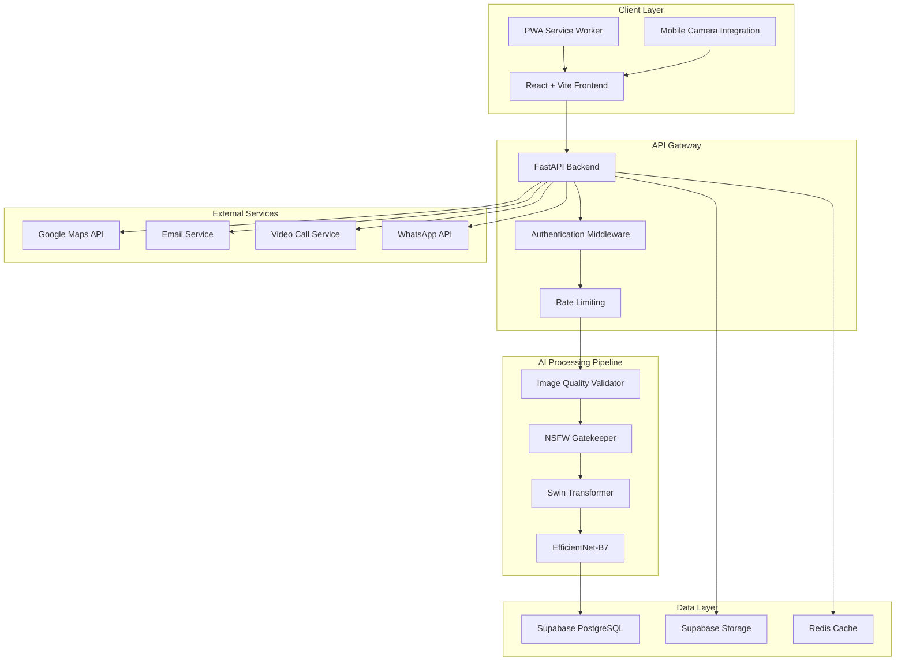
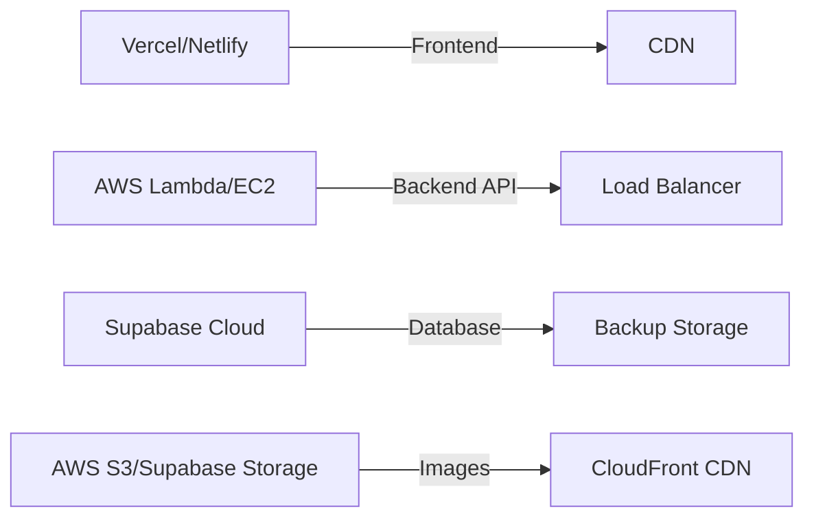

# Design Document: SkinGuard AI Skin Cancer Screening Platform

## Overview

SkinGuard is a full-stack web application that combines AI-powered medical image analysis with a comprehensive healthcare management system. The platform uses a three-tier architecture: a React frontend for user interaction, a FastAPI backend for AI processing and business logic, and Supabase (PostgreSQL) for data persistence. The system implements a multi-layered security approach with NSFW content filtering as the first line of defense, followed by medical AI analysis using state-of-the-art deep learning models (Swin Transformer and EfficientNet-B7).

The design prioritizes patient safety through emergency referral systems, data privacy through encryption and GDPR compliance, and accessibility through mobile-first responsive design with PWA capabilities. The platform supports multiple user roles (patients, doctors, admins) with distinct workflows and permissions, integrated telemedicine capabilities, and a comprehensive notification system.

## Architecture

### High-Level System Architecture



### Technology Stack

**Frontend:**
- React 18+ with TypeScript
- Vite for build tooling
- Framer Motion for animations
- React Query for data fetching
- Zustand for state management
- Tailwind CSS for styling
- React Dropzone for file uploads
- Google Maps React for map integration
- Workbox for PWA functionality

**Backend:**
- FastAPI (Python 3.10+)
- Pydantic for data validation
- PyTorch for AI model inference
- Pillow for image processing
- python-multipart for file uploads
- python-jose for JWT handling
- Redis for caching and rate limiting

**Database & Storage:**
- Supabase PostgreSQL for relational data
- Supabase Storage for image files
- Redis for session management and caching

**AI Models:**
- NSFW Detector (Yahoo Open NSFW or NudeNet)
- Swin Transformer for lesion localization
- EfficientNet-B7 for cancer classification

**External Services:**
- Google Maps JavaScript API
- SendGrid or AWS SES for email
- Twilio or Agora for video calls
- WhatsApp Business API

### Deployment Architecture



## Components and Interfaces

### Frontend Components

#### 1. Authentication Module

**Components:**
- `LoginForm`: Email/password authentication
- `SignupForm`: User registration with role selection
- `AuthProvider`: Context provider for authentication state
- `ProtectedRoute`: Route guard for authenticated pages

**Key Functions:**
```typescript
interface AuthService {
  login(email: string, password: string): Promise<User>
  signup(email: string, password: string, role: UserRole): Promise<User>
  logout(): Promise<void>
  getCurrentUser(): User | null
  refreshSession(): Promise<void>
}
```

#### 2. Patient Dashboard

**Components:**
- `DiagnosticUploader`: Drag-and-drop image upload with camera integration
- `SymptomWizard`: Multi-step form for symptom collection
- `ResultsDisplay`: AI prediction visualization with hotspot overlays
- `ReportHistory`: Timeline view of past screenings
- `ComparisonView`: Side-by-side lesion comparison

**Key Interfaces:**
```typescript
interface UploadState {
  file: File | null
  preview: string | null
  uploading: boolean
  progress: number
}

interface SymptomData {
  location: BodyLocation
  sensations: Sensation[]
  visualChanges: VisualChange[]
  duration: string
}

interface AIResult {
  reportId: string
  predictions: CancerPrediction[]
  hotspots: Hotspot[]
  riskLevel: 'low' | 'medium' | 'high' | 'urgent'
  disclaimer: string
}
```

#### 3. Doctor Locator

**Components:**
- `DoctorMap`: Google Maps with doctor markers
- `DoctorCard`: Doctor profile with rating and contact
- `FilterPanel`: Search and filter doctors by specialty, rating, distance
- `AppointmentBooking`: Appointment scheduling interface

**Key Interfaces:**
```typescript
interface Doctor {
  id: string
  name: string
  clinicName: string
  location: { lat: number; lng: number }
  whatsappNo: string
  rating: number
  reviewCount: number
  verified: boolean
}

interface MapMarker {
  position: { lat: number; lng: number }
  doctor: Doctor
  onClick: () => void
}
```

#### 4. Admin Panel

**Components:**
- `DoctorVerification`: Review and approve doctor applications
- `ContentModeration`: Review flagged images and reports
- `AnalyticsDashboard`: Platform metrics and usage statistics
- `SkinWikiEditor`: Content management for educational articles

### Backend API Endpoints

#### Authentication Endpoints

```python
POST /api/auth/signup
POST /api/auth/login
POST /api/auth/logout
GET /api/auth/me
POST /api/auth/refresh
```

#### Patient Endpoints

```python
POST /api/analyze-skin
  - Multipart form data with image file
  - Returns: AI analysis results
  
GET /api/reports
  - Returns: List of patient's medical reports
  
GET /api/reports/{report_id}
  - Returns: Detailed report with image and predictions
  
POST /api/reports/{report_id}/compare/{other_report_id}
  - Returns: Comparison analysis between two reports
  
PUT /api/patient/profile
  - Updates patient health profile
```

#### Doctor Endpoints

```python
GET /api/doctors/nearby
  - Query params: lat, lng, radius
  - Returns: List of verified doctors within radius
  
GET /api/doctors/{doctor_id}
  - Returns: Doctor profile with ratings
  
POST /api/doctors/register
  - Doctor registration with license info
  
GET /api/doctors/reports/pending
  - Returns: Pending patient reports for review
  
POST /api/doctors/reports/{report_id}/notes
  - Add consultation notes to report
```

#### Appointment Endpoints

```python
POST /api/appointments
  - Create new appointment
  
GET /api/appointments
  - List user's appointments
  
PUT /api/appointments/{appointment_id}
  - Update appointment status
  
POST /api/appointments/{appointment_id}/video-room
  - Generate video consultation room
```

#### Admin Endpoints

```python
GET /api/admin/doctors/pending
  - List pending doctor verifications
  
PUT /api/admin/doctors/{doctor_id}/verify
  - Approve or reject doctor
  
GET /api/admin/reports/flagged
  - List flagged content
  
GET /api/admin/analytics
  - Platform usage statistics
```

### AI Processing Pipeline

#### Image Processing Flow

```python
class ImageProcessor:
    def validate_quality(self, image: Image) -> QualityResult:
        """
        Validates image meets minimum quality standards
        - Resolution >= 512x512
        - Blur score < threshold
        - Brightness within acceptable range
        """
        pass
    
    def check_nsfw(self, image: Image) -> NSFWResult:
        """
        NSFW content detection
        - Returns scores for: safe, nsfw, non_skin
        - Rejects if nsfw > 0.35 or non_skin > 0.8
        """
        pass
    
    def detect_lesions(self, image: Image) -> List[Hotspot]:
        """
        Swin Transformer lesion localization
        - Returns bounding boxes and confidence scores
        """
        pass
    
    def classify_cancer(self, image: Image) -> List[CancerPrediction]:
        """
        EfficientNet-B7 cancer classification
        - Returns probabilities for 7 cancer types
        """
        pass

class AnalysisPipeline:
    async def process_image(self, image_file: UploadFile) -> AnalysisResult:
        """
        Complete analysis pipeline:
        1. Quality validation
        2. NSFW filtering
        3. Lesion detection
        4. Cancer classification
        5. Risk assessment
        6. Database storage
        """
        # Load image
        image = await self.load_image(image_file)
        
        # Step 1: Quality check
        quality = self.processor.validate_quality(image)
        if not quality.passed:
            raise QualityError(quality.message)
        
        # Step 2: NSFW check (Gatekeeper)
        nsfw_result = self.processor.check_nsfw(image)
        if nsfw_result.nsfw_score > 0.35 or nsfw_result.non_skin_score > 0.8:
            await self.log_flagged_content(image_file, nsfw_result)
            raise ContentViolationError("Inappropriate content detected")
        
        # Step 3: Lesion detection
        hotspots = self.processor.detect_lesions(image)
        
        # Step 4: Cancer classification
        predictions = self.processor.classify_cancer(image)
        
        # Step 5: Risk assessment
        risk_level = self.assess_risk(predictions)
        
        # Step 6: Store results
        report = await self.save_report(image_file, hotspots, predictions, risk_level)
        
        # Step 7: Handle urgent cases
        if risk_level == "urgent":
            await self.trigger_emergency_referral(report)
        
        return AnalysisResult(
            report_id=report.id,
            hotspots=hotspots,
            predictions=predictions,
            risk_level=risk_level
        )
```

## Data Models

### Database Schema

#### profiles Table

```sql
CREATE TABLE profiles (
    id UUID PRIMARY KEY DEFAULT uuid_generate_v4(),
    email TEXT UNIQUE NOT NULL,
    full_name TEXT NOT NULL,
    avatar_url TEXT,
    role TEXT NOT NULL CHECK (role IN ('patient', 'doctor', 'admin')),
    verified BOOLEAN DEFAULT FALSE,
    language_preference TEXT DEFAULT 'en',
    created_at TIMESTAMP WITH TIME ZONE DEFAULT NOW(),
    updated_at TIMESTAMP WITH TIME ZONE DEFAULT NOW()
);

CREATE INDEX idx_profiles_role ON profiles(role);
CREATE INDEX idx_profiles_verified ON profiles(verified);
```

#### patient_data Table

```sql
CREATE TABLE patient_data (
    id UUID PRIMARY KEY DEFAULT uuid_generate_v4(),
    user_id UUID NOT NULL REFERENCES profiles(id) ON DELETE CASCADE,
    age INTEGER CHECK (age > 0 AND age <= 120),
    skin_type TEXT CHECK (skin_type IN ('I', 'II', 'III', 'IV', 'V', 'VI')),
    family_history TEXT,
    created_at TIMESTAMP WITH TIME ZONE DEFAULT NOW(),
    updated_at TIMESTAMP WITH TIME ZONE DEFAULT NOW(),
    UNIQUE(user_id)
);

CREATE INDEX idx_patient_data_user ON patient_data(user_id);
```

#### doctors Table

```sql
CREATE TABLE doctors (
    id UUID PRIMARY KEY DEFAULT uuid_generate_v4(),
    user_id UUID NOT NULL REFERENCES profiles(id) ON DELETE CASCADE,
    license_no TEXT NOT NULL UNIQUE,
    clinic_name TEXT NOT NULL,
    lat DECIMAL(10, 8) NOT NULL,
    lng DECIMAL(11, 8) NOT NULL,
    whatsapp_no TEXT NOT NULL,
    specialization TEXT,
    average_rating DECIMAL(3, 2) DEFAULT 0.0,
    review_count INTEGER DEFAULT 0,
    created_at TIMESTAMP WITH TIME ZONE DEFAULT NOW(),
    updated_at TIMESTAMP WITH TIME ZONE DEFAULT NOW(),
    UNIQUE(user_id)
);

CREATE INDEX idx_doctors_location ON doctors USING GIST (
    ll_to_earth(lat, lng)
);
CREATE INDEX idx_doctors_verified ON doctors(user_id);
```

#### medical_reports Table

```sql
CREATE TABLE medical_reports (
    id UUID PRIMARY KEY DEFAULT uuid_generate_v4(),
    patient_id UUID NOT NULL REFERENCES profiles(id) ON DELETE CASCADE,
    image_url TEXT NOT NULL,
    ai_prediction JSONB NOT NULL,
    symptoms JSONB,
    status TEXT NOT NULL CHECK (status IN ('safe', 'flagged', 'urgent')),
    risk_level TEXT CHECK (risk_level IN ('low', 'medium', 'high', 'urgent')),
    body_location TEXT,
    consultation_notes TEXT,
    created_at TIMESTAMP WITH TIME ZONE DEFAULT NOW(),
    updated_at TIMESTAMP WITH TIME ZONE DEFAULT NOW()
);

CREATE INDEX idx_reports_patient ON medical_reports(patient_id);
CREATE INDEX idx_reports_status ON medical_reports(status);
CREATE INDEX idx_reports_risk ON medical_reports(risk_level);
CREATE INDEX idx_reports_created ON medical_reports(created_at DESC);
```

#### appointments Table

```sql
CREATE TABLE appointments (
    id UUID PRIMARY KEY DEFAULT uuid_generate_v4(),
    patient_id UUID NOT NULL REFERENCES profiles(id) ON DELETE CASCADE,
    doctor_id UUID NOT NULL REFERENCES doctors(id) ON DELETE CASCADE,
    report_id UUID REFERENCES medical_reports(id),
    scheduled_at TIMESTAMP WITH TIME ZONE NOT NULL,
    status TEXT NOT NULL CHECK (status IN ('pending', 'confirmed', 'completed', 'cancelled')),
    consultation_type TEXT CHECK (consultation_type IN ('in_person', 'video')),
    video_room_url TEXT,
    created_at TIMESTAMP WITH TIME ZONE DEFAULT NOW(),
    updated_at TIMESTAMP WITH TIME ZONE DEFAULT NOW()
);

CREATE INDEX idx_appointments_patient ON appointments(patient_id);
CREATE INDEX idx_appointments_doctor ON appointments(doctor_id);
CREATE INDEX idx_appointments_scheduled ON appointments(scheduled_at);
```

#### reviews Table

```sql
CREATE TABLE reviews (
    id UUID PRIMARY KEY DEFAULT uuid_generate_v4(),
    patient_id UUID NOT NULL REFERENCES profiles(id) ON DELETE CASCADE,
    doctor_id UUID NOT NULL REFERENCES doctors(id) ON DELETE CASCADE,
    appointment_id UUID REFERENCES appointments(id),
    rating INTEGER NOT NULL CHECK (rating >= 1 AND rating <= 5),
    review_text TEXT,
    flagged BOOLEAN DEFAULT FALSE,
    created_at TIMESTAMP WITH TIME ZONE DEFAULT NOW(),
    UNIQUE(patient_id, appointment_id)
);

CREATE INDEX idx_reviews_doctor ON reviews(doctor_id);
CREATE INDEX idx_reviews_rating ON reviews(rating);
```

#### notifications Table

```sql
CREATE TABLE notifications (
    id UUID PRIMARY KEY DEFAULT uuid_generate_v4(),
    user_id UUID NOT NULL REFERENCES profiles(id) ON DELETE CASCADE,
    type TEXT NOT NULL,
    title TEXT NOT NULL,
    message TEXT NOT NULL,
    read BOOLEAN DEFAULT FALSE,
    metadata JSONB,
    created_at TIMESTAMP WITH TIME ZONE DEFAULT NOW()
);

CREATE INDEX idx_notifications_user ON notifications(user_id);
CREATE INDEX idx_notifications_read ON notifications(read);
CREATE INDEX idx_notifications_created ON notifications(created_at DESC);
```

#### audit_logs Table

```sql
CREATE TABLE audit_logs (
    id UUID PRIMARY KEY DEFAULT uuid_generate_v4(),
    user_id UUID REFERENCES profiles(id),
    action TEXT NOT NULL,
    resource_type TEXT NOT NULL,
    resource_id UUID,
    metadata JSONB,
    ip_address INET,
    created_at TIMESTAMP WITH TIME ZONE DEFAULT NOW()
);

CREATE INDEX idx_audit_logs_user ON audit_logs(user_id);
CREATE INDEX idx_audit_logs_created ON audit_logs(created_at DESC);
```

### TypeScript Data Models

```typescript
// User and Authentication
interface User {
  id: string
  email: string
  fullName: string
  avatarUrl?: string
  role: 'patient' | 'doctor' | 'admin'
  verified: boolean
  languagePreference: string
  createdAt: string
  updatedAt: string
}

// Patient Data
interface PatientData {
  id: string
  userId: string
  age: number
  skinType: 'I' | 'II' | 'III' | 'IV' | 'V' | 'VI'
  familyHistory?: string
  createdAt: string
  updatedAt: string
}

// Doctor Data
interface Doctor {
  id: string
  userId: string
  licenseNo: string
  clinicName: string
  lat: number
  lng: number
  whatsappNo: string
  specialization?: string
  averageRating: number
  reviewCount: number
  createdAt: string
  updatedAt: string
}

// Medical Report
interface MedicalReport {
  id: string
  patientId: string
  imageUrl: string
  aiPrediction: AIPrediction
  symptoms?: SymptomData
  status: 'safe' | 'flagged' | 'urgent'
  riskLevel: 'low' | 'medium' | 'high' | 'urgent'
  bodyLocation?: string
  consultationNotes?: string
  createdAt: string
  updatedAt: string
}

interface AIPrediction {
  predictions: CancerPrediction[]
  hotspots: Hotspot[]
  modelVersion: string
  processingTime: number
}

interface CancerPrediction {
  type: string
  probability: number
  confidence: number
}

interface Hotspot {
  x: number
  y: number
  width: number
  height: number
  confidence: number
}

// Appointments
interface Appointment {
  id: string
  patientId: string
  doctorId: string
  reportId?: string
  scheduledAt: string
  status: 'pending' | 'confirmed' | 'completed' | 'cancelled'
  consultationType: 'in_person' | 'video'
  videoRoomUrl?: string
  createdAt: string
  updatedAt: string
}

// Reviews
interface Review {
  id: string
  patientId: string
  doctorId: string
  appointmentId?: string
  rating: number
  reviewText?: string
  flagged: boolean
  createdAt: string
}

// Notifications
interface Notification {
  id: string
  userId: string
  type: string
  title: string
  message: string
  read: boolean
  metadata?: Record<string, any>
  createdAt: string
}
```


## Correctness Properties

*A property is a characteristic or behavior that should hold true across all valid executions of a system—essentially, a formal statement about what the system should do. Properties serve as the bridge between human-readable specifications and machine-verifiable correctness guarantees.*

### Property Reflection

After analyzing all acceptance criteria, I identified the following redundancies and consolidations:

**Redundant Properties:**
- Properties 4.6 and 14.1 both test disclaimer presence - consolidated into single property
- Properties 1.3 and 2.5 both test profile update persistence - consolidated into general update property
- Multiple properties test foreign key integrity (12.4, 12.5) - consolidated into single referential integrity property
- Properties testing field presence in records (1.1, 6.1, 8.2) - consolidated into record completeness properties

**Combined Properties:**
- Authorization properties (1.4, 1.5, 1.6, 6.5, 6.6) - combined into role-based access control property
- Notification properties (17.1-17.6) - combined into general notification delivery property
- Quality validation properties (24.1-24.4) - combined into image quality validation property

### Core Properties

#### Property 1: User Registration Completeness
*For any* user registration with valid data, the created profile record should contain all required fields (UUID, full name, role, verification status) and be retrievable from the database.
**Validates: Requirements 1.1**

#### Property 2: Authentication Round Trip
*For any* valid user credentials, successful login should return a session token that can be used to retrieve the same user's profile information.
**Validates: Requirements 1.2**

#### Property 3: Profile Update Persistence
*For any* user profile and any valid update data, applying the update then fetching the profile should return the updated values.
**Validates: Requirements 1.3, 2.5**

#### Property 4: Role-Based Access Control
*For any* user with a specific role, access to endpoints should match their role permissions: patients access diagnostic features, unverified doctors are blocked from reports, verified doctors access reports, and admins access moderation features.
**Validates: Requirements 1.4, 1.5, 1.6, 6.5, 6.6**

#### Property 5: Age Validation Bounds
*For any* integer input for patient age, the system should accept only values in the range [1, 120] and reject all others with a validation error.
**Validates: Requirements 2.2**

#### Property 6: Fitzpatrick Scale Enum Validation
*For any* string input for skin type, the system should accept only valid Fitzpatrick Scale values (I, II, III, IV, V, VI) and reject all others.
**Validates: Requirements 2.3**

#### Property 7: Text Storage Without Truncation
*For any* text input of arbitrary length for family history, the system should store and retrieve the complete text without truncation.
**Validates: Requirements 2.4**

#### Property 8: NSFW Score Rejection Threshold
*For any* image with NSFW score exceeding 0.35, the system should reject the upload and return HTTP 403 with error message "Inappropriate content detected".
**Validates: Requirements 3.2, 3.4**

#### Property 9: Non-Skin Score Rejection Threshold
*For any* image with non-skin score exceeding 0.8, the system should reject the upload and return HTTP 403 with error message "Inappropriate content detected".
**Validates: Requirements 3.3, 3.4**

#### Property 10: Flagged Content Audit Logging
*For any* image rejected by the NSFW filter, an audit log entry should be created with timestamp, user identifier, and rejection reason.
**Validates: Requirements 3.6**

#### Property 11: Cancer Classification Completeness
*For any* successful AI classification, the returned predictions should contain exactly 7 cancer types, each with a probability score between 0 and 1, and all probabilities should sum to approximately 1.0.
**Validates: Requirements 4.3**

#### Property 12: AI Analysis Persistence
*For any* completed AI analysis, storing the results then retrieving the medical report should return the same prediction data in JSONB format.
**Validates: Requirements 4.4, 12.2**

#### Property 13: Medical Disclaimer Presence
*For any* AI prediction display, the rendered output should contain the disclaimer text "This is a 94% probability estimate. Please consult verified doctors for clinical biopsy".
**Validates: Requirements 4.6, 14.1**

#### Property 14: Symptom Data Completeness
*For any* completed symptom wizard, the stored symptom data should include body location (Step 1), sensations (Step 2), and visual changes (Step 3).
**Validates: Requirements 5.2, 5.3, 5.4, 5.5**

#### Property 15: Symptom-Report Association
*For any* saved symptom data, the medical_reports record should correctly reference both the patient_id and contain the symptom JSONB data.
**Validates: Requirements 5.6**

#### Property 16: Doctor Registration Completeness
*For any* doctor registration, the created doctors record should contain all required fields (license number, clinic name, coordinates, WhatsApp number) and initial verified status should be false.
**Validates: Requirements 6.1, 6.2**

#### Property 17: Doctor Verification State Transition
*For any* doctor with verified status false, admin approval should transition verified to true, and this change should be immediately reflected in access permissions.
**Validates: Requirements 6.4**

#### Property 18: Verified Doctor Filtering
*For any* doctor locator query, the returned list should contain only doctors where verified status is true.
**Validates: Requirements 7.2**

#### Property 19: Doctor Marker Coordinate Accuracy
*For any* list of doctors, the map markers should be placed at coordinates exactly matching the lat and lng fields from the database.
**Validates: Requirements 7.3**

#### Property 20: WhatsApp URL Format
*For any* doctor's WhatsApp contact, the generated URL should match the format "https://wa.me/{whatsapp_no}?text=I would like to share my Derman Report" where {whatsapp_no} is the doctor's WhatsApp number.
**Validates: Requirements 7.5**

#### Property 21: Appointment Creation Completeness
*For any* appointment creation, the appointments record should contain all required fields (patient_id, doctor_id, scheduled_at, status) and initial status should be "pending".
**Validates: Requirements 8.2, 8.3**

#### Property 22: Doctor Appointment Filtering
*For any* doctor viewing appointments, the returned list should contain only appointments where doctor_id matches their profile UUID.
**Validates: Requirements 8.4**

#### Property 23: Appointment Status Transition Rules
*For any* appointment where scheduled_at timestamp has passed, status updates to "completed" or "cancelled" should be allowed, but updates to "pending" should be rejected.
**Validates: Requirements 8.5**

#### Property 24: Safe Report Filtering
*For any* doctor accessing the reports dashboard, the returned medical_reports should only include records where status is "safe" or "urgent", excluding "flagged" reports.
**Validates: Requirements 9.1**

#### Property 25: Report Display Completeness
*For any* medical report display, the data should include the image URL, AI prediction JSONB, patient symptoms, and joined patient_data (age, skin type, family history).
**Validates: Requirements 9.2, 9.3**

#### Property 26: Cancer Class Display Completeness
*For any* report containing AI predictions, the display should show probability scores for all 7 cancer classes.
**Validates: Requirements 9.4**

#### Property 27: Consultation Notes Persistence
*For any* doctor adding consultation notes to a report, storing the notes then retrieving the report should return the same notes text.
**Validates: Requirements 9.5**

#### Property 28: Pending Doctor Application Filtering
*For any* admin accessing the admin panel, the returned doctor list should only include profiles where role is "doctor" and verified status is false.
**Validates: Requirements 10.1**

#### Property 29: Flagged Content Filtering
*For any* admin viewing flagged content, the returned medical_reports should only include records where status is "flagged".
**Validates: Requirements 10.2**

#### Property 30: Flagged Content Metadata Completeness
*For any* flagged report, the displayed data should include the image URL, NSFW score, and rejection reason from audit logs.
**Validates: Requirements 10.4**

#### Property 31: Content Update Persistence
*For any* admin updating Skin-Wiki content, storing the update then retrieving the content should return the updated text with a new timestamp.
**Validates: Requirements 10.5**

#### Property 32: Image Storage Round Trip
*For any* uploaded image file, storing it to Supabase Storage then retrieving via the returned URL should yield the same image data.
**Validates: Requirements 12.3**

#### Property 33: Referential Integrity Enforcement
*For any* attempt to create a medical_report or appointment with invalid patient_id or doctor_id (not existing in profiles/doctors tables), the database should reject the operation with a foreign key constraint error.
**Validates: Requirements 12.4, 12.5**

#### Property 34: Multipart Form Data Acceptance
*For any* image upload request with content-type "multipart/form-data", the /api/analyze-skin endpoint should accept and process the request.
**Validates: Requirements 13.2**

#### Property 35: HTTP Status Code Correctness
*For any* API error, the response should use appropriate HTTP status codes: 403 for content violations, 400 for validation errors, 401 for authentication failures, 404 for not found, and 500 for server errors.
**Validates: Requirements 13.4**

#### Property 36: JSON Response Format
*For any* successful API response, the content-type header should be "application/json" and the body should be valid JSON.
**Validates: Requirements 13.5**

#### Property 37: Educational Content Disclaimer Presence
*For any* medical information page, the rendered output should include disclaimers about the educational nature of the content.
**Validates: Requirements 14.4**

#### Property 38: Report History Ordering
*For any* patient accessing their dashboard, the returned medical_reports should be ordered by created_at timestamp in descending order (newest first).
**Validates: Requirements 15.1**

#### Property 39: Report History Display Completeness
*For any* report in the history list, the displayed data should include thumbnail image, AI prediction summary, submission date, and status.
**Validates: Requirements 15.2**

#### Property 40: Historical Report Retrieval Completeness
*For any* historical report selection, the retrieved data should include the full-resolution image, complete AI predictions, and all symptom data.
**Validates: Requirements 15.3**

#### Property 41: Same-Location Report Grouping
*For any* patient with multiple reports, reports sharing the same body_location value should be grouped together and offer comparison functionality.
**Validates: Requirements 15.4**

#### Property 42: Report Comparison Change Detection
*For any* two reports being compared, the system should compute and highlight differences in lesion size, color descriptors, and AI risk_level.
**Validates: Requirements 15.5**

#### Property 43: Follow-Up Screening Suggestion
*For any* report where created_at timestamp is more than 6 months in the past, the display should include a follow-up screening suggestion.
**Validates: Requirements 15.6**

#### Property 44: Skin-Wiki Cancer Type Completeness
*For any* Skin-Wiki section access, the displayed content should include articles for all 7 skin cancer types with images and descriptions.
**Validates: Requirements 16.1**

#### Property 45: Cancer Type Article Completeness
*For any* cancer type article, the content should include sections for risk factors, symptoms, and treatment options.
**Validates: Requirements 16.2**

#### Property 46: Educational Content Availability
*For any* educational content view, self-examination guides with illustrated body maps should be accessible.
**Validates: Requirements 16.3**

#### Property 47: Prevention Tips Completeness
*For any* prevention tips display, the content should include UV protection recommendations and early detection guidelines.
**Validates: Requirements 16.4**

#### Property 48: Contextual Educational Links
*For any* AI result with a detected cancer type, the display should include links to Skin-Wiki articles matching that specific cancer type.
**Validates: Requirements 16.5**

#### Property 49: Content Version Tracking
*For any* educational content update by admins, the system should create a new version record with timestamp and maintain history of previous versions.
**Validates: Requirements 16.6**

#### Property 50: Notification Delivery
*For any* triggering event (analysis completion, appointment confirmation, verification status change), the system should create and deliver notifications to all affected users.
**Validates: Requirements 17.1, 17.2, 17.3, 17.4, 17.5, 17.6**

#### Property 51: Image Encryption at Rest
*For any* stored medical image, the file metadata should indicate AES-256 encryption is applied.
**Validates: Requirements 18.1**

#### Property 52: HTTPS Transport Encryption
*For any* client-server communication, the connection should use HTTPS protocol with valid TLS certificate.
**Validates: Requirements 18.2**

#### Property 53: Account Deletion Cascade
*For any* patient account deletion, all associated medical_reports and patient_data records should be marked for deletion and removed within 30 days.
**Validates: Requirements 18.3**

#### Property 54: Data Access Audit Logging
*For any* user accessing their medical data, an audit_logs entry should be created with timestamp, user_id, and accessed resource information.
**Validates: Requirements 18.4**

#### Property 55: Privacy Settings Opt-Out Availability
*For any* patient viewing privacy settings, the interface should include an option to opt out of data sharing for research purposes.
**Validates: Requirements 18.5**

#### Property 56: Data Export Format Validity
*For any* patient data export request, the returned file should be valid JSON or PDF format and contain all user's medical reports and profile data.
**Validates: Requirements 18.6**

#### Property 57: Browser Language Detection
*For any* first-time visitor, the system should detect the browser's Accept-Language header and set the interface language to match if supported.
**Validates: Requirements 19.1**

#### Property 58: Language Preference Persistence
*For any* user changing language preference, storing the preference then reloading the page should display the interface in the selected language.
**Validates: Requirements 19.2**

#### Property 59: Disclaimer Translation
*For any* medical disclaimer display, the text should be shown in the user's selected language preference.
**Validates: Requirements 19.3**

#### Property 60: AI Result Translation
*For any* AI result display, cancer type names and descriptions should be translated to the user's selected language.
**Validates: Requirements 19.4**

#### Property 61: Minimum Language Support
*For any* language selection interface, the available options should include at minimum: English, Spanish, French, German, and Mandarin Chinese.
**Validates: Requirements 19.5**

#### Property 62: Content Translation Completeness
*For any* new educational content, the system should prevent publication until translations exist for all supported languages.
**Validates: Requirements 19.6**

#### Property 63: AI Processing Time Logging
*For any* AI analysis, the system should log separate processing times for NSFW Gatekeeper and Medical_AI (Swin + EfficientNet) stages.
**Validates: Requirements 20.1**

#### Property 64: API Metrics Tracking
*For any* API endpoint call, the system should record response time and success/error status in metrics storage.
**Validates: Requirements 20.2**

#### Property 65: Analytics Dashboard Metrics Completeness
*For any* admin accessing the analytics dashboard, the displayed data should include daily active users, total screenings performed, and average processing time.
**Validates: Requirements 20.3**

#### Property 66: Performance Degradation Alerting
*For any* API response taking longer than 5 seconds, the system should send an alert notification to administrators.
**Validates: Requirements 20.4**

#### Property 67: Usage Pattern Statistics
*For any* usage analysis query, the system should provide statistics on most common cancer types detected and geographic distribution of users.
**Validates: Requirements 20.5**

#### Property 68: Weekly Health Report Generation
*For any* week, the system should generate a summary report containing platform health metrics (uptime, error rates, user activity).
**Validates: Requirements 20.6**

#### Property 69: Mobile Camera Capture Availability
*For any* mobile device user uploading an image, the upload interface should offer both file selection and direct camera capture options.
**Validates: Requirements 21.2**

#### Property 70: PWA Offline Functionality
*For any* PWA installation in offline mode, historical medical reports should be accessible from cached data.
**Validates: Requirements 21.3**

#### Property 71: Network Reconnection Sync
*For any* network connectivity restoration after offline period, the system should sync pending uploads and fetch new data from the server.
**Validates: Requirements 21.4**

#### Property 72: GPS Location Centering
*For any* mobile user accessing the doctor locator map, the map should center on the device's GPS coordinates if location permission is granted.
**Validates: Requirements 21.5**

#### Property 73: Review Prompt After Appointment
*For any* appointment with status "completed", the system should prompt the patient for a rating (1-5 stars) and optional review text.
**Validates: Requirements 22.1**

#### Property 74: Review Association and Visibility
*For any* submitted review, the system should associate it with the doctor's profile and make it publicly visible on the doctor's page.
**Validates: Requirements 22.2**

#### Property 75: Doctor Rating Statistics Display
*For any* doctor profile display, the interface should show the average rating (computed from all reviews) and total review count.
**Validates: Requirements 22.3**

#### Property 76: Review Flagging Availability
*For any* review displayed to a doctor, the interface should include a "flag for review" option to report inappropriate content.
**Validates: Requirements 22.4**

#### Property 77: Doctor Ranking Calculation
*For any* doctor ranking computation, the algorithm should use both average rating and number of consultations as input factors.
**Validates: Requirements 22.5**

#### Property 78: Low Rating Admin Notification
*For any* review with rating below 3 stars, the system should send a notification to admins for quality assurance review.
**Validates: Requirements 22.6**

#### Property 79: High-Risk Urgent Flagging
*For any* AI prediction where any cancer type probability exceeds 85%, the system should set the report's status to "urgent".
**Validates: Requirements 23.1**

#### Property 80: Urgent Report Warning Display
*For any* report with status "urgent", the patient interface should display a prominent warning message.
**Validates: Requirements 23.2**

#### Property 81: Nearest Doctor Notification
*For any* urgent case detection, the system should identify and notify the 3 nearest verified doctors via email.
**Validates: Requirements 23.3**

#### Property 82: Emergency Consultation Button Presence
*For any* urgent result display, the interface should include an "Emergency Consultation" button with emergency contact information.
**Validates: Requirements 23.4**

#### Property 83: Urgent Case Prioritization
*For any* doctor viewing pending reports, urgent cases should appear at the top of the list before non-urgent cases.
**Validates: Requirements 23.5**

#### Property 84: Urgent Case Escalation
*For any* urgent case remaining unreviewed for 24 hours, the system should send escalation notifications to admins.
**Validates: Requirements 23.6**

#### Property 85: Image Resolution Validation
*For any* uploaded image, the system should validate that resolution is at least 512x512 pixels and reject smaller images.
**Validates: Requirements 24.1**

#### Property 86: Low Resolution Error Message
*For any* image rejected due to insufficient resolution, the error message should be "Image resolution too low for accurate analysis".
**Validates: Requirements 24.2**

#### Property 87: Image Quality Validation
*For any* uploaded image, the system should calculate blur score and brightness histogram, warning users if quality is below acceptable thresholds.
**Validates: Requirements 24.3, 24.4**

#### Property 88: Quality Validation Guidance
*For any* image failing quality validation, the system should provide specific guidance on how to capture a better image (e.g., "Ensure good lighting", "Hold camera steady").
**Validates: Requirements 24.6**

#### Property 89: Consultation Type Options
*For any* appointment booking interface, the system should offer both "in-person" and "video" consultation type options.
**Validates: Requirements 25.1**

#### Property 90: Video Room URL Uniqueness
*For any* video consultation appointment, the system should generate a unique meeting room URL that is not reused for other appointments.
**Validates: Requirements 25.2**

#### Property 91: Video Link Distribution
*For any* appointment at scheduled_at time, the system should send the video room URL to both patient and doctor.
**Validates: Requirements 25.3**

#### Property 92: Consultation Notes Persistence
*For any* ended video consultation, the doctor should be able to add notes, and storing then retrieving the report should return those notes.
**Validates: Requirements 25.5**

#### Property 93: Video Encryption Compliance
*For any* video consultation, the video SDK configuration should enforce HIPAA-compliant encryption standards.
**Validates: Requirements 25.6**


## Error Handling

### Error Classification

**Client Errors (4xx):**
- 400 Bad Request: Invalid input data, validation failures
- 401 Unauthorized: Missing or invalid authentication token
- 403 Forbidden: NSFW content detected, insufficient permissions
- 404 Not Found: Resource does not exist
- 409 Conflict: Duplicate resource (e.g., email already registered)
- 422 Unprocessable Entity: Valid syntax but semantic errors

**Server Errors (5xx):**
- 500 Internal Server Error: Unexpected server failures
- 502 Bad Gateway: AI model service unavailable
- 503 Service Unavailable: Database connection failures, rate limit exceeded
- 504 Gateway Timeout: AI processing timeout

### Error Response Format

All API errors should return consistent JSON structure:

```typescript
interface ErrorResponse {
  error: {
    code: string           // Machine-readable error code
    message: string        // Human-readable error message
    details?: any          // Additional context (validation errors, etc.)
    timestamp: string      // ISO 8601 timestamp
    requestId: string      // Unique request identifier for debugging
  }
}
```

### Specific Error Scenarios

#### Image Upload Errors

```python
class ImageUploadError(Exception):
    """Base class for image upload errors"""
    pass

class QualityError(ImageUploadError):
    """Image quality below acceptable threshold"""
    def __init__(self, reason: str):
        self.code = "IMAGE_QUALITY_ERROR"
        self.message = f"Image quality insufficient: {reason}"
        self.status_code = 400

class ContentViolationError(ImageUploadError):
    """NSFW or inappropriate content detected"""
    def __init__(self, nsfw_score: float, non_skin_score: float):
        self.code = "CONTENT_VIOLATION"
        self.message = "Inappropriate content detected"
        self.status_code = 403
        self.details = {
            "nsfw_score": nsfw_score,
            "non_skin_score": non_skin_score
        }

class FileSizeError(ImageUploadError):
    """File size exceeds maximum allowed"""
    def __init__(self, size: int, max_size: int):
        self.code = "FILE_TOO_LARGE"
        self.message = f"File size {size}MB exceeds maximum {max_size}MB"
        self.status_code = 400
```

#### Authentication Errors

```python
class AuthenticationError(Exception):
    """Authentication failures"""
    def __init__(self, reason: str):
        self.code = "AUTH_ERROR"
        self.message = reason
        self.status_code = 401

class AuthorizationError(Exception):
    """Insufficient permissions"""
    def __init__(self, required_role: str):
        self.code = "INSUFFICIENT_PERMISSIONS"
        self.message = f"This action requires {required_role} role"
        self.status_code = 403
```

#### AI Processing Errors

```python
class AIProcessingError(Exception):
    """AI model inference failures"""
    def __init__(self, stage: str, reason: str):
        self.code = "AI_PROCESSING_ERROR"
        self.message = f"AI processing failed at {stage}: {reason}"
        self.status_code = 500
        self.details = {"stage": stage}

class ModelUnavailableError(AIProcessingError):
    """AI model service unavailable"""
    def __init__(self, model_name: str):
        self.code = "MODEL_UNAVAILABLE"
        self.message = f"AI model {model_name} is currently unavailable"
        self.status_code = 503
```

### Error Handling Strategy

**Frontend Error Handling:**
- Display user-friendly error messages
- Provide actionable guidance (e.g., "Please retake photo with better lighting")
- Log errors to monitoring service (Sentry, LogRocket)
- Implement retry logic for transient failures
- Show offline indicators when network unavailable

**Backend Error Handling:**
- Catch all exceptions at API boundary
- Log errors with full context (user_id, request_id, stack trace)
- Never expose internal implementation details in error messages
- Implement circuit breakers for external services (AI models, email)
- Use exponential backoff for retries

**Database Error Handling:**
- Handle foreign key constraint violations gracefully
- Implement connection pooling with retry logic
- Use transactions for multi-step operations
- Rollback on failures to maintain consistency

## Testing Strategy

### Dual Testing Approach

SkinGuard will use both **unit tests** and **property-based tests** to ensure comprehensive coverage:

- **Unit tests**: Verify specific examples, edge cases, and error conditions
- **Property tests**: Verify universal properties across all inputs using randomized testing

Both testing approaches are complementary and necessary. Unit tests catch concrete bugs in specific scenarios, while property tests verify general correctness across the input space.

### Property-Based Testing Framework

**Language**: Python (backend), TypeScript (frontend)

**Libraries**:
- Python: **Hypothesis** for property-based testing
- TypeScript: **fast-check** for property-based testing
- Both: pytest (Python), Jest/Vitest (TypeScript) for test runners

**Configuration**:
- Minimum 100 iterations per property test (due to randomization)
- Each property test must reference its design document property
- Tag format: `# Feature: derman-ai-skin-screening, Property {number}: {property_text}`

### Test Organization

```
tests/
├── unit/
│   ├── auth/
│   │   ├── test_registration.py
│   │   ├── test_login.py
│   │   └── test_permissions.py
│   ├── ai/
│   │   ├── test_nsfw_filter.py
│   │   ├── test_quality_validation.py
│   │   └── test_classification.py
│   ├── api/
│   │   ├── test_patient_endpoints.py
│   │   ├── test_doctor_endpoints.py
│   │   └── test_admin_endpoints.py
│   └── database/
│       ├── test_models.py
│       └── test_queries.py
├── property/
│   ├── test_auth_properties.py
│   ├── test_data_properties.py
│   ├── test_ai_properties.py
│   └── test_api_properties.py
├── integration/
│   ├── test_upload_flow.py
│   ├── test_appointment_flow.py
│   └── test_doctor_verification_flow.py
└── e2e/
    ├── test_patient_journey.py
    └── test_doctor_journey.py
```

### Property Test Examples

#### Example 1: User Registration Completeness (Property 1)

```python
from hypothesis import given, strategies as st
import pytest

# Feature: derman-ai-skin-screening, Property 1: User Registration Completeness
@given(
    email=st.emails(),
    full_name=st.text(min_size=1, max_size=100),
    role=st.sampled_from(['patient', 'doctor', 'admin'])
)
def test_user_registration_completeness(email, full_name, role):
    """
    For any user registration with valid data, the created profile record 
    should contain all required fields and be retrievable from the database.
    """
    # Register user
    user = register_user(email=email, full_name=full_name, role=role)
    
    # Verify all required fields are present
    assert user.id is not None
    assert user.email == email
    assert user.full_name == full_name
    assert user.role == role
    assert user.verified is not None
    
    # Verify retrievability
    retrieved_user = get_user_by_id(user.id)
    assert retrieved_user.id == user.id
    assert retrieved_user.email == user.email
```

#### Example 2: NSFW Score Rejection (Property 8)

```python
from hypothesis import given, strategies as st
from hypothesis import assume

# Feature: derman-ai-skin-screening, Property 8: NSFW Score Rejection Threshold
@given(
    nsfw_score=st.floats(min_value=0.36, max_value=1.0),
    image_data=st.binary(min_size=1024, max_size=10240)
)
def test_nsfw_rejection_threshold(nsfw_score, image_data):
    """
    For any image with NSFW score exceeding 0.35, the system should reject 
    the upload and return HTTP 403 with appropriate error message.
    """
    # Mock NSFW detector to return the given score
    with mock_nsfw_detector(nsfw_score=nsfw_score):
        response = upload_image(image_data)
        
        # Verify rejection
        assert response.status_code == 403
        assert "Inappropriate content detected" in response.json()["error"]["message"]
        
        # Verify audit log created
        logs = get_audit_logs(action="content_violation")
        assert len(logs) > 0
        assert logs[-1].metadata["nsfw_score"] == nsfw_score
```

#### Example 3: Profile Update Persistence (Property 3)

```python
from hypothesis import given, strategies as st

# Feature: derman-ai-skin-screening, Property 3: Profile Update Persistence
@given(
    original_name=st.text(min_size=1, max_size=100),
    updated_name=st.text(min_size=1, max_size=100),
    original_avatar=st.text(min_size=10, max_size=200),
    updated_avatar=st.text(min_size=10, max_size=200)
)
def test_profile_update_persistence(original_name, updated_name, original_avatar, updated_avatar):
    """
    For any user profile and any valid update data, applying the update 
    then fetching the profile should return the updated values.
    """
    # Create user with original data
    user = create_test_user(full_name=original_name, avatar_url=original_avatar)
    
    # Update profile
    update_profile(user.id, full_name=updated_name, avatar_url=updated_avatar)
    
    # Fetch and verify
    retrieved = get_user_by_id(user.id)
    assert retrieved.full_name == updated_name
    assert retrieved.avatar_url == updated_avatar
```

### Unit Test Examples

#### Example 1: Specific Age Validation Edge Cases

```python
def test_age_validation_edge_cases():
    """Test specific boundary values for age validation"""
    # Valid boundaries
    assert validate_age(1) == True
    assert validate_age(120) == True
    
    # Invalid boundaries
    assert validate_age(0) == False
    assert validate_age(121) == False
    assert validate_age(-1) == False
    
    # Invalid types
    with pytest.raises(ValidationError):
        validate_age("25")
    with pytest.raises(ValidationError):
        validate_age(25.5)
```

#### Example 2: Specific NSFW Threshold Boundary

```python
def test_nsfw_threshold_boundary():
    """Test exact boundary value for NSFW rejection"""
    # Just below threshold - should pass
    image_safe = create_mock_image(nsfw_score=0.35)
    result = process_image(image_safe)
    assert result.status == "safe"
    
    # At threshold - should reject
    image_threshold = create_mock_image(nsfw_score=0.36)
    with pytest.raises(ContentViolationError):
        process_image(image_threshold)
```

### Integration Tests

Integration tests verify that multiple components work together correctly:

```python
def test_complete_upload_and_analysis_flow():
    """Test the complete patient upload flow from image to results"""
    # Setup
    patient = create_test_patient()
    image = load_test_image("valid_lesion.jpg")
    symptoms = create_test_symptoms()
    
    # Upload image
    response = upload_image(patient.id, image, symptoms)
    assert response.status_code == 200
    report_id = response.json()["report_id"]
    
    # Verify report created
    report = get_medical_report(report_id)
    assert report.patient_id == patient.id
    assert report.status == "safe"
    assert len(report.ai_prediction["predictions"]) == 7
    
    # Verify notification sent
    notifications = get_notifications(patient.id)
    assert any(n.type == "analysis_complete" for n in notifications)
```

### End-to-End Tests

E2E tests verify complete user journeys:

```python
def test_patient_journey_e2e(browser):
    """Test complete patient journey from registration to doctor booking"""
    # Register
    browser.visit("/signup")
    browser.fill("email", "patient@test.com")
    browser.fill("password", "SecurePass123!")
    browser.select("role", "patient")
    browser.click("button[type=submit]")
    
    # Complete health profile
    browser.fill("age", "35")
    browser.select("skin_type", "III")
    browser.fill("family_history", "No family history")
    browser.click("button.save-profile")
    
    # Upload image
    browser.visit("/diagnostic")
    browser.attach_file("image", "test_lesion.jpg")
    browser.fill("body_location", "left_arm")
    browser.check("sensation_itching")
    browser.click("button.analyze")
    
    # Wait for results
    browser.wait_for_text("Analysis Complete", timeout=30)
    assert browser.is_text_present("94% probability estimate")
    
    # Find doctor
    browser.click("button.find-doctor")
    browser.wait_for_element(".doctor-marker", timeout=10)
    browser.click(".doctor-marker:first")
    
    # Book appointment
    browser.click("button.book-appointment")
    browser.select("consultation_type", "video")
    browser.click("button.confirm-booking")
    
    assert browser.is_text_present("Appointment confirmed")
```

### Test Coverage Goals

- **Unit tests**: 80%+ code coverage
- **Property tests**: All 93 correctness properties implemented
- **Integration tests**: All critical user flows covered
- **E2E tests**: Patient and doctor journeys covered

### Continuous Integration

All tests should run on every commit:

```yaml
# .github/workflows/test.yml
name: Test Suite
on: [push, pull_request]

jobs:
  test:
    runs-on: ubuntu-latest
    steps:
      - uses: actions/checkout@v2
      - name: Run unit tests
        run: pytest tests/unit -v
      - name: Run property tests
        run: pytest tests/property -v --hypothesis-profile=ci
      - name: Run integration tests
        run: pytest tests/integration -v
      - name: Upload coverage
        uses: codecov/codecov-action@v2
```

### Performance Testing

In addition to functional testing, performance benchmarks should be established:

- AI analysis should complete within 10 seconds for 95th percentile
- API endpoints should respond within 200ms for 95th percentile
- Database queries should complete within 100ms for 95th percentile
- Page load time should be under 3 seconds on 3G connection

Use tools like Locust or k6 for load testing and performance monitoring.
