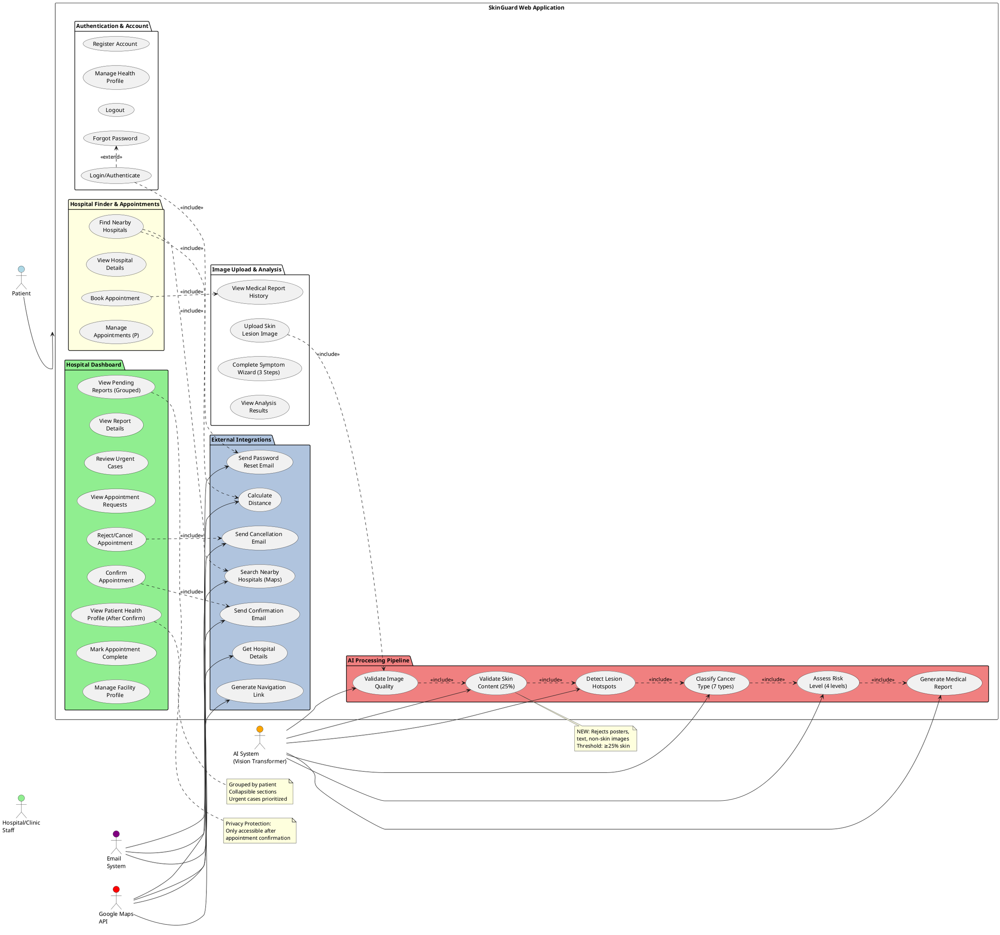

# Updated Use Case Diagram for SkinGuard Web Application

## Analysis of Current System vs Old Diagram

### Changes from Old System:
1. ✅ **Kept**: Login/Admin, Register Account, Upload Images, View Quality, Manage Patient Data
2. ✅ **Enhanced**: AI Analysis now includes skin validation, risk classification
3. ✅ **Added**: Find Hospitals (Google Maps), Appointment Management, Privacy Protection
4. ✅ **Changed**: "Doctor" → "Hospital/Clinic" (facility-based system)
5. ❌ **Removed**: "Manage Doctor Info" (now "Manage Facility Profile")

---

## NEW USE CASE DIAGRAM DESCRIPTION

### Actors:
1. **Patient** (Primary User)
2. **Hospital/Clinic Staff** (Doctor/Dermatologist)
3. **AI System** (External System - Vision Transformer)
4. **Google Maps API** (External System)
5. **Email System** (External System - for notifications)

---

## USE CASES BY ACTOR

### 🧑 PATIENT USE CASES

#### Authentication & Account Management
1. **Register Account**
   - Description: Create new patient account with email and password
   - Precondition: None
   - Postcondition: Patient account created in system
   - Includes: Email validation

2. **Login/Authenticate**
   - Description: Login with credentials to access patient dashboard
   - Precondition: Account exists
   - Postcondition: Authenticated session created
   - Extends: Forgot Password

3. **Manage Health Profile**
   - Description: Create/update patient health information
   - Precondition: Logged in
   - Postcondition: Health profile saved
   - Fields: Age, Fitzpatrick Skin Type, Family History
   - Includes: Data validation (age 1-120, skin type I-VI)

4. **Logout**
   - Description: End authenticated session
   - Precondition: Logged in
   - Postcondition: Session terminated

#### Image Upload & Analysis
5. **Upload Skin Lesion Image**
   - Description: Upload photo of skin lesion for AI analysis
   - Precondition: Logged in
   - Postcondition: Image stored, analysis initiated
   - Includes: File type validation (JPEG/PNG), Size validation (max 10MB)
   - Triggers: AI Image Analysis

6. **Complete Symptom Wizard** (NEW)
   - Description: 3-step wizard to record symptoms
   - Precondition: Image uploaded
   - Postcondition: Symptom data stored with report
   - Steps:
     - Step 1: Select body location
     - Step 2: Select sensations (itching, pain, burning, etc.)
     - Step 3: Select visual changes (color, size, shape, etc.)
   - Optional: Duration input

7. **View Analysis Results**
   - Description: View AI predictions and risk assessment
   - Precondition: Analysis completed
   - Postcondition: Results displayed
   - Shows: Cancer type probabilities, risk level, confidence scores
   - Includes: View Quality Metrics

8. **View Medical Report History**
   - Description: Access all past skin analysis reports
   - Precondition: Logged in
   - Postcondition: List of reports displayed
   - Filters: By date, by risk level
   - Actions: View details, Download PDF

#### Hospital Finder & Appointments (NEW)
9. **Find Nearby Hospitals**
   - Description: Search for dermatology hospitals/clinics nearby
   - Precondition: Logged in
   - Postcondition: List of hospitals displayed on map
   - Includes: Google Maps Integration
   - Uses: Patient's location (GPS or manual input)
   - Shows: Hospital ratings, distance, operating hours

10. **View Hospital Details**
    - Description: View detailed information about a hospital
    - Precondition: Hospital selected
    - Postcondition: Details displayed
    - Shows: Address, phone, rating, reviews, map link

11. **Book Appointment**
    - Description: Request appointment with hospital for consultation
    - Precondition: Medical report exists
    - Postcondition: Appointment request sent to hospital
    - Includes: Select report, Select date/time, Add notes
    - Status: Pending (until hospital confirms)

12. **Manage Appointments**
    - Description: View and manage all appointments
    - Precondition: Logged in
    - Postcondition: Appointments displayed
    - Actions: View details, Cancel appointment
    - Filters: By status (pending, confirmed, completed, cancelled)

---

### 🏥 HOSPITAL/CLINIC STAFF USE CASES

#### Authentication & Profile Management
13. **Login/Authenticate**
    - Description: Login with hospital credentials
    - Precondition: Account exists
    - Postcondition: Authenticated session created

14. **Manage Facility Profile** (UPDATED from "Manage Doctor Info")
    - Description: Update hospital/clinic information
    - Precondition: Logged in as hospital staff
    - Postcondition: Profile updated
    - Fields: Facility name, Description, Operating hours, Contact info, Specialties

#### Report Review & Triage
15. **View Pending Reports** (NEW)
    - Description: View all patient reports grouped by patient
    - Precondition: Logged in
    - Postcondition: Reports displayed by patient
    - Features:
      - Grouped by patient (collapsible sections)
      - Sorted by urgency (urgent cases first)
      - Shows "URGENT" badge for high-risk cases
      - Patient names hidden until appointment confirmed (privacy)

16. **View Report Details**
    - Description: Open detailed view of a medical report
    - Precondition: Report selected
    - Postcondition: Full report displayed
    - Shows: AI predictions, symptom data, image, risk assessment

17. **Review Urgent Cases** (NEW)
    - Description: Filter and prioritize urgent/high-risk reports
    - Precondition: Logged in
    - Postcondition: Only urgent reports displayed
    - Criteria: Risk level = "urgent" or "high"

#### Appointment Management
18. **View Appointment Requests** (NEW)
    - Description: View all pending appointment requests
    - Precondition: Logged in
    - Postcondition: Requests displayed
    - Shows: Patient name (hidden if pending), date, report preview

19. **Confirm Appointment** (NEW)
    - Description: Accept patient appointment request
    - Precondition: Appointment pending
    - Postcondition: Appointment confirmed, patient details revealed
    - Triggers: Email notification to patient
    - Effect: Patient identity and medical history now visible

20. **Reject/Cancel Appointment** (NEW)
    - Description: Decline appointment request
    - Precondition: Appointment pending/confirmed
    - Postcondition: Appointment cancelled
    - Triggers: Email notification to patient

21. **View Patient Health Profile** (NEW)
    - Description: Access full patient medical history
    - Precondition: Appointment confirmed
    - Postcondition: Patient profile displayed
    - Shows: Name, age, skin type, family history, all medical reports
    - Privacy: Only accessible after appointment confirmation

22. **Mark Appointment Complete** (NEW)
    - Description: Mark consultation as completed
    - Precondition: Appointment confirmed
    - Postcondition: Appointment status = completed
    - Optional: Add consultation notes

---

### 🤖 AI SYSTEM USE CASES (Automated)

23. **Validate Image Quality** (ENHANCED)
    - Description: Check image meets minimum quality standards
    - Trigger: Image uploaded
    - Checks: Resolution (≥300x300), Blur score, Brightness
    - Result: Pass/Fail
    - Extends: AI Image Analysis

24. **Validate Skin Content** (NEW)
    - Description: Verify image contains skin (not poster/text)
    - Trigger: Quality check passed
    - Algorithm: Skin percentage calculation + text detection
    - Threshold: ≥25% skin-like pixels, no text/graphics
    - Result: Pass (proceed to analysis) / Fail (reject with error)

25. **Detect Lesion Hotspots** (UPDATED)
    - Description: Identify lesion locations in image
    - Trigger: Skin validation passed
    - Model: Swin Transformer
    - Output: Bounding boxes with confidence scores
    - Extends: AI Image Analysis

26. **Classify Cancer Type** (UPDATED)
    - Description: Predict cancer type using Vision Transformer
    - Trigger: Lesion detected
    - Model: ViT (Hugging Face Anwarkh1/Skin_Cancer-Image_Classification)
    - Input: Skin lesion image
    - Output: 7 cancer type probabilities
      1. Melanoma
      2. Basal Cell Carcinoma
      3. Actinic Keratoses
      4. Benign Keratosis-Like Lesions
      5. Dermatofibroma
      6. Vascular Lesions
      7. Melanocytic Nevi
    - Accuracy: 84%

27. **Assess Risk Level** (NEW)
    - Description: Classify report into risk categories
    - Trigger: Classification complete
    - Algorithm: Based on cancer probability
    - Output: 
      - Low (<20% malignancy)
      - Medium (20-50%)
      - High (50-80%)
      - Urgent (>80%)
    - Effect: Determines report priority for doctors

28. **Generate Medical Report** (UPDATED)
    - Description: Create structured medical report
    - Trigger: Risk assessment complete
    - Includes: 
      - AI predictions (all 7 types)
      - Risk level
      - Symptom data
      - Image with hotspots
      - Timestamp
      - Disclaimer
    - Postcondition: Report saved to database

---

### 🗺️ GOOGLE MAPS API USE CASES (External System)

29. **Search Nearby Hospitals**
    - Description: Find dermatology hospitals within radius
    - Trigger: Patient clicks "Find Hospitals"
    - Input: Patient location, radius (50km)
    - Search Strategy:
      1. Dermatology specialists (keyword: "dermatology skin")
      2. Dermatology clinics (keyword: "dermatology skin clinic")
      3. General hospitals (no keyword)
    - Output: Up to 180 hospital results

30. **Get Hospital Details**
    - Description: Fetch detailed hospital information
    - Trigger: Hospital selected from list
    - Output: Name, address, phone, rating, reviews, photos

31. **Calculate Distance**
    - Description: Compute distance from patient to hospital
    - Algorithm: Haversine formula (GPS coordinates)
    - Output: Distance in kilometers

32. **Generate Navigation Link**
    - Description: Create Google Maps navigation URL
    - Trigger: Patient clicks "View on Maps"
    - Output: Deep link to Google Maps app/website

---

### 📧 EMAIL SYSTEM USE CASES (External System)

33. **Send Appointment Confirmation Email** (NEW)
    - Description: Notify patient when appointment confirmed
    - Trigger: Hospital confirms appointment
    - Content: Hospital name, date, time, location, instructions

34. **Send Appointment Cancellation Email** (NEW)
    - Description: Notify patient when appointment cancelled
    - Trigger: Hospital/patient cancels appointment
    - Content: Reason (if provided), next steps

35. **Send Password Reset Email** (Extends Login)
    - Description: Email password reset link
    - Trigger: Patient clicks "Forgot Password"
    - Content: Secure reset link (JWT token)

---

## RELATIONSHIPS & DEPENDENCIES

### Include Relationships (mandatory sub-use cases):
- Upload Image → **includes** → File Validation
- AI Image Analysis → **includes** → Validate Quality, Validate Skin, Detect Lesions, Classify Cancer, Assess Risk
- Register Account → **includes** → Email Validation
- Manage Health Profile → **includes** → Data Validation
- Find Hospitals → **includes** → Google Maps Search
- Book Appointment → **includes** → Select Report
- Confirm Appointment → **includes** → Send Confirmation Email

### Extend Relationships (optional additions):
- Login → **extends** → Forgot Password
- View Report → **extends** → Download PDF
- Book Appointment → **extends** → Add Notes

### Generalization Relationships:
- Manage Appointments (Patient) **generalizes to** → View Appointments, Cancel Appointment
- Manage Appointments (Hospital) **generalizes to** → View Requests, Confirm, Reject, Complete

---

## USE CASE DIAGRAM STRUCTURE (PlantUML Format)

---

## SUMMARY OF MAJOR CHANGES

### ✅ NEW USE CASES (Not in Old Diagram):
1. **Complete Symptom Wizard** - 3-step patient input
2. **Validate Skin Content** - Reject non-skin images (25% threshold)
3. **Find Nearby Hospitals** - Google Maps integration
4. **Book Appointment** - Patient-initiated scheduling
5. **View Pending Reports (Grouped)** - Organized by patient
6. **Review Urgent Cases** - Priority triage
7. **Confirm/Reject Appointment** - Hospital approval workflow
8. **View Patient Health Profile** - Post-confirmation access
9. **Privacy Protection** - Hide patient data until confirmed
10. **Email Notifications** - Automated appointment emails

### 🔄 UPDATED USE CASES:
- **Manage Doctor Info** → **Manage Facility Profile** (facility-based)
- **AI Image Analysis** → Now includes skin validation + risk classification
- **Classification** → 7 cancer types (from Vision Transformer)

### ❌ REMOVED USE CASES:
- None (all old features retained, but enhanced)

---

## HOW TO CREATE THE DIAGRAM:

### Option 1: Using PlantUML (Recommended)
1. Copy the PlantUML code above
2. Go to http://www.plantuml.com/plantuml/uml/
3. Paste the code
4. Generate PNG/SVG

### Option 2: Using Draw.io / Lucidchart
1. Create actors on left and right sides
2. Draw system boundary box
3. Add oval use cases
4. Connect with arrows (solid = association, dashed = include/extend)
5. Use different colors for different packages

### Option 3: Using Visual Paradigm / Enterprise Architect
1. Create UML Use Case Diagram
2. Add actors and use cases as described
3. Add relationships
4. Export as image

---

Would you like me to:
1. Create a simplified version with fewer use cases?
2. Generate the actual diagram image file?
3. Create separate diagrams for Patient vs Hospital workflows?
